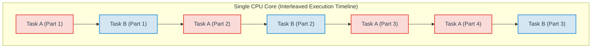
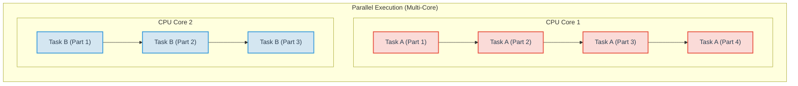

# Day 18 - Chapter 17: Async Rust

In this chapter, we will cover the fundamentals of asynchronous programming in Rust.

By this point, you know how to write multithreaded code from Chapter 16. However, threads are not the only way to do multiple things at once. Rust provides **async/await** as a powerful, lightweight alternative for concurrent programming.

---

## 1. Concurrency vs. Parallelism

Before diving into `async`, it is crucial to understand the difference between concurrency and parallelism:

- **Concurrency**: Dealing with multiple tasks at once. The CPU switches between tasks (interleaving execution) so they all make progress. For example, while waiting for a database query to return, the CPU starts handling another web request. This can happen on a single CPU core.
- **Parallelism**: Doing multiple tasks at the exact same time. This requires multiple CPU cores, where each core executes a different task simultaneously.

Here is a visual breakdown of how tasks are scheduled under both models:

### Visualizing Concurrency vs. Parallelism

#### Concurrency (Single CPU Core — Interleaved)
In a concurrent (but non-parallel) system, a single CPU core switches context between **Task A** and **Task B**. Although they seem to run at the same time to the user, only one instruction is executed at any given millisecond.



#### Parallelism (Multi-Core CPU — Simultaneous)
In a parallel system, multiple CPU cores are available. **Task A** runs continuously on **Core 1**, while **Task B** runs continuously on **Core 2** at the exact same time.



> [!NOTE]
> **Async Rust's** focus is primarily on **Concurrency**. It allows a single thread to manage thousands of open tasks (like network connections) by pausing them when they are waiting for I/O and letting other tasks run on the same thread. However, modern runtimes (like Tokio) can also run tasks in **Parallel** by scheduling them across multiple OS threads (and thus multiple CPU cores).

Rust’s `async` feature gives us a powerful way to write highly concurrent code.

---

## 2. The `async` and `await` Keywords

To write asynchronous code in Rust, you use the `async` keyword. When you mark a function as `async`, it no longer returns the result directly. Instead, it returns a **Future**.

```rust
async fn fetch_data() -> String {
    String::from("Data fetched!")
}
```

If you call this function normally, **nothing happens**. It just creates a Future:

```rust
let future = fetch_data(); // The function has not started running yet!
```

To actually execute the future and get the result, you must `await` it:

```rust
async fn process() {
    let data = fetch_data().await;
    println!("{}", data);
}
```

The `.await` keyword pauses the current function until the `Future` is complete. While this function is paused, the CPU is free to go do other work!

---

## 3. What is a Future?

In Rust, a `Future` is a value that might not be ready right now, but will be ready at some point in the future.

Think of it like a restaurant buzzer. You place an order (call the async function), and the cashier hands you a buzzer (the Future). You can go sit down, talk to your friends, or read a book (do other work) until the buzzer flashes (the Future is ready). When it flashes, you go to the counter (`.await`) to get your food (the result).

---

## 4. The Need for a Runtime

Rust is unique. The standard library understands `async`/`await` syntax and the `Future` trait, but **it does not provide a way to run them**. 

You need an executor (a runtime) to actually poll the Futures and drive them to completion.

The most popular runtime in the Rust ecosystem is **Tokio**. To use Tokio, you add it to your `Cargo.toml` and use the `#[tokio::main]` macro on your `main` function:

```rust
#[tokio::main]
async fn main() {
    let data = fetch_data().await;
    println!("Received: {}", data);
}
```

Under the hood, Tokio sets up a thread pool and manages all your async tasks efficiently.

---

## 5. Async vs. Threads

We learned about OS threads in Chapter 16. Why would we use `async` instead of threads?

### OS Threads
- **Heavyweight**: Creating a thread takes significant memory and OS resources.
- **Best for CPU-bound tasks**: Heavy calculations, video rendering, math processing.

### Async
- **Lightweight**: You can have millions of async tasks running concurrently on a single thread.
- **Best for I/O-bound tasks**: Web servers, database queries, reading files, network requests.

In modern Rust, you often use both: a thread pool running thousands of lightweight async tasks!

---

## 6. Concurrent Execution (`join!`)

What if you have two async tasks and you want them to run at the same time? If you `.await` them one by one, they run sequentially.

```rust
// Sequential (Slow)
// We wait for 'a' to finish, THEN we start 'b'
let a = fetch_data().await;
let b = fetch_data().await;
```

To run them concurrently, you can use macros like `join!` (provided by the `tokio` or `futures` crates):

```rust
// Concurrent (Fast)
// Both tasks start and run at the same time
let (a, b) = tokio::join!(fetch_data(), fetch_data());
```

`join!` waits for both futures to complete and gives you both results at once.

---

## 7. Common Mistakes to Avoid

1. **Blocking an async thread**
   Never run heavy CPU calculations or use standard thread blocking (like `std::thread::sleep`) inside an `async` function. It blocks the entire thread, meaning no other async tasks can run! Always use async alternatives (like `tokio::time::sleep`).

2. **Forgetting `.await`**
   If you forget to `.await`, the future does absolutely nothing. Rust will helpfully give you a compiler warning: *"futures do nothing unless you `.await` or poll them."*

---

## 8. Final Summary

- **`async fn`** returns a lazy `Future`.
- **`.await`** waits for a `Future` to complete without blocking the underlying OS thread.
- You must use a third-party **runtime** (like Tokio) to execute async code.
- Use `async` for **I/O-bound** tasks (network, files) and OS threads for **CPU-bound** tasks.
- Group futures together with `join!` to run them concurrently.

Asynchronous programming in Rust might feel tricky at first, but thinking of it as "pausing and resuming tasks" makes it much more intuitive.
